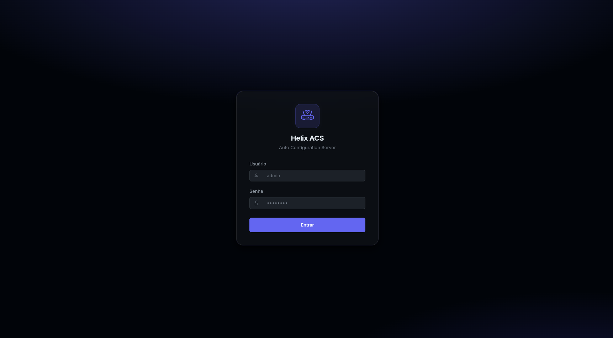
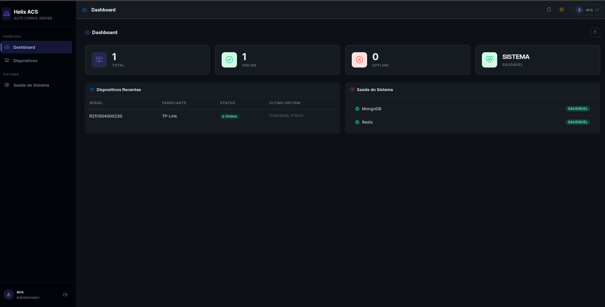
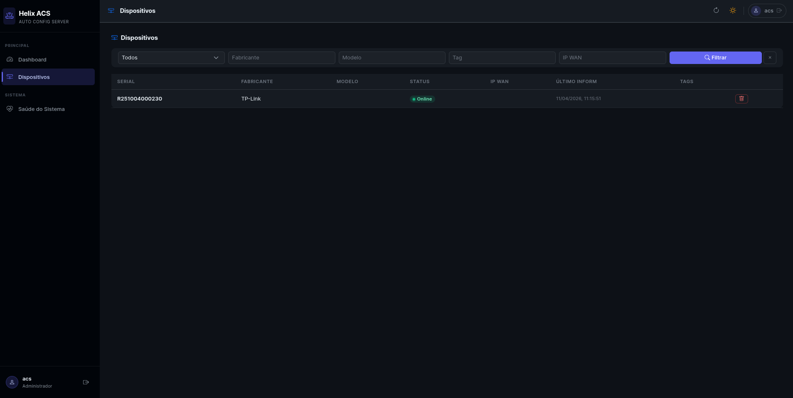
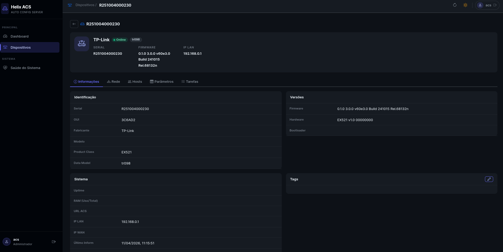
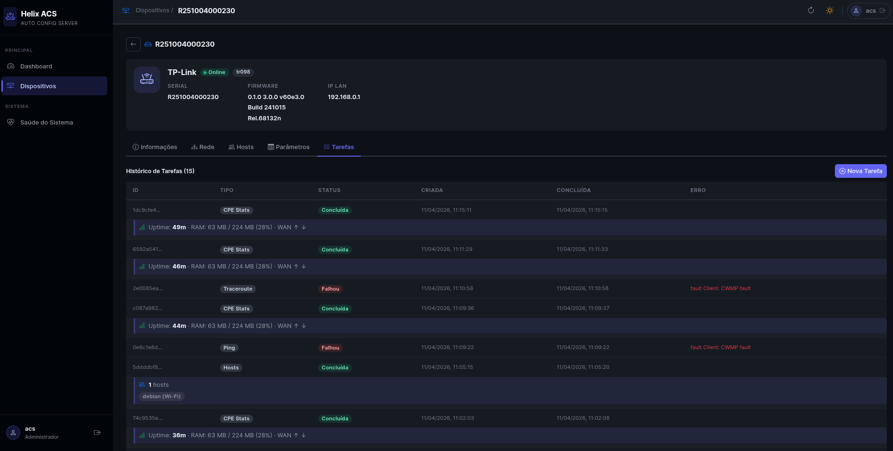
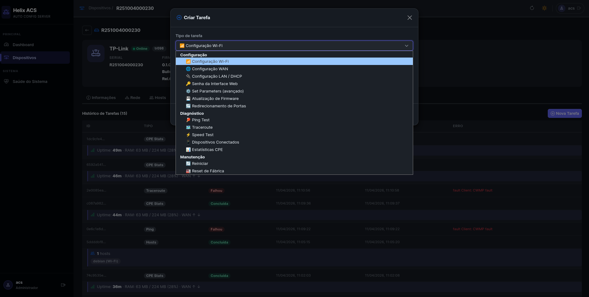
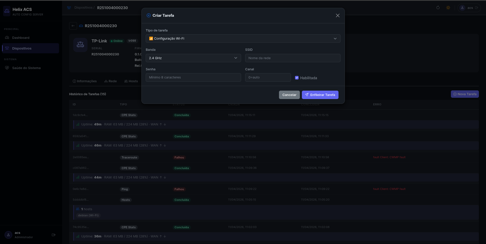
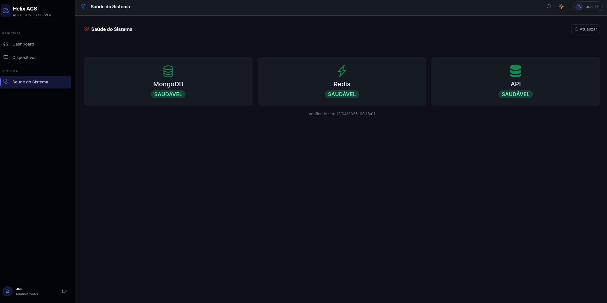

# Helix ACS

[](https://pkg.go.dev/github.com/raykavin/helix-acs)
[](https://golang.org/dl/)
[](https://goreportcard.com/report/github.com/raykavin/helix-acs)
[](LICENSE.md)

### Auto Configuration Server (ACS) for CPE Management


An Auto Configuration Server (ACS) for managing CPE equipment via the TR-069 (CWMP) protocol. It allows provisioning, monitoring, and executing remote tasks on routers and modems from any manufacturer that implements the TR-181 or TR-098 data models.

Complete CPE parameters (after *summon*) are persisted in **PostgreSQL** (queryable history); **MongoDB** stores the device document; **Redis** queues CWMP tasks.

## Table of Contents

- [Overview](#overview)
- [Features](#features)
- [Architecture](#architecture)
- [Prerequisites](#prerequisites)
- [Configuration](#configuration)
- [Running](#running)
- [Web interface](#web-interface)
- [REST API](#rest-api)
- [CWMP Tasks](#cwmp-tasks)
- [Data models](#data-models)
- [Parameter schemas](#parameter-schemas)
- [Device drivers (YAML)](#device-drivers-yaml)
- [Development](#development)

---

## Screenshots

**Login**



**Dashboard**



**Devices**



**Device details**






**Task creation**






**System health**



---

## Overview

Helix ACS operates as the server side of the TR-069 protocol. When a router or modem (CPE) is powered on, it contacts the ACS via HTTP/SOAP. The server then registers the device, applies pending configurations, and collects statistics — all transparently to the end user.

Two HTTP servers run simultaneously:

- **CWMP Server** on port `7547`: receives CPE connections (Digest authentication)
- **API and web interface server** on port `8080`: used by administrators (JWT authentication)

## Features

**Device management**
- Automatic CPE registration on first contact (Inform)
- Dynamic discovery of TR-181 and TR-098 instance numbers (with optional *hints* per model in `driver.yaml`)
- Automatic data model detection (TR-181 or TR-098)
- Automatic schema resolution by manufacturer (e.g., Huawei, ZTE, TP-Link) with fallback to the generic schema
- **YAML drivers** per manufacturer/model: provisioning flows (WAN/WiFi), `default_params` applied after *full summon*, and WiFi mapping (e.g., SSID ↔ band when `LowerLayers` does not exist)
- **Summon**: full parameter update with *throttle* (~2 min); when a WiFi/WAN task is pending within the throttle window, *summon* can be **targeted** (`Device.WiFi.`, `Device.IP.Interface.`, etc.) for a faster round trip
- Filtering and pagination on device listing
- Tag and metadata editing

**Remote tasks**
- Wi-Fi configuration (SSID, password, channel, 2.4 GHz and 5 GHz bands)
- WAN configuration (PPPoE, DHCP, static IP, VLAN, MTU)
- LAN and DHCP server configuration
- Device web interface password change
- Firmware update via URL
- Port forwarding (add, remove, list)
- Reboot and factory reset
- Set/Get of arbitrary TR-069 parameters

**Diagnostics**
- Ping test with detailed results (minimum, average, maximum RTT and packet loss)
- Traceroute with hop listing
- Speed test (download)
- Connected device listing (DHCP hosts)
- CPE statistics (uptime, RAM, WAN counters)

**Web interface**
- Dashboard with device summary and system status

## Architecture

```
CPE (router/modem)
      |
      | HTTP/SOAP (TR-069 / CWMP)
      |
      v
+---------------------+        +----------+
|  CWMP Server        |        | MongoDB  |
|  port 7547          +------->+ (devices)|
|                     |        +----------+
|  Digest Auth        |        +----------+
+---------------------+        |PostgreSQL|
                               | (params) |
                               +----------+
+---------------------+        +----------+
|  REST API + Web UI  +------->+  Redis   |
|  port 8080          |        | (tasks)  |
|                     |        +----------+
|  JWT Auth           |
+---------------------+
      ^
      |
  Administrator (browser / API client)
```

**Main packages:**

| Package | Responsibility |
|---|---|
| `cmd/api` | Entry point, dependency composition, and server initialization |
| `internal/cwmp` | CWMP protocol: SOAP parsing, Inform session, task execution |
| `internal/api` | HTTP routing, REST handlers, middlewares (CORS, JWT, rate limit, logging) |
| `internal/device` | Device model, MongoDB repository, and service |
| `internal/task` | Task types, payloads, Redis queue, and executor |
| `internal/datamodel` | `Mapper` interface, TR-181 and TR-098 mappers with dynamic instance discovery |
| `internal/schema` | YAML schema registry, `SchemaMapper`, driver registry (`driver.yaml` + provisions) |
| `internal/parameter` | TR-069 parameter persistence and history (PostgreSQL, optional Redis cache) |
| `internal/auth` | JWT and Digest Auth |
| `internal/config` | Configuration loading and validation (Viper) |
| `web` | Web interface embedded in the binary (HTML, CSS, JS) |

## Prerequisites

- Go 1.25 or higher
- MongoDB 7
- PostgreSQL 16+ (parameter storage / history; see `application.postgresql` and `scripts/schema-postgresql.sql` in Compose)
- Redis 7
- Docker and Docker Compose (optional, for containerized execution)

## Configuration

Copy the example file and adjust the values:

```bash
cp configs/config.example.yml configs/config.yml
```

The required fields that must be changed before the first run are:

| Field | Description |
|---|---|
| `application.jwt.secret` | Secret for signing JWT tokens. Use `openssl rand -base64 32` to generate a secure value. |
| `application.acs.password` | Password that CPEs use to authenticate with the ACS. |
| `application.acs.url` | Public ACS URL provisioned in CPEs (must be accessible from the CPE network). |
| `databases.cache.uri` | Redis connection URI. |
| `databases.storage.uri` | MongoDB connection URI. |
| `application.postgresql.*` | Host, port, user, password, and database used by the parameter repository. |
| `application.parameters.*` | Parameter backend (`postgresql`), cache, history, and daily *snapshots*. |

See the [configs/config.example.yml](configs/config.example.yml) file for the full description of each field.

### Configuration reference

**`application`**

| Field | Type | Description |
|---|---|---|
| `name` | string | Name displayed in the startup banner |
| `log_level` | string | Log level: `debug`, `info`, `warn`, `error` |
| `jwt.secret` | string | Secret key for JWT tokens |
| `jwt.expires_in` | duration | Access token validity (e.g., `24h`) |
| `jwt.refresh_expires_in` | duration | Refresh token validity (e.g., `168h`) |

**`application.acs`**

| Field | Type | Description |
|---|---|---|
| `listen_port` | int | CWMP server port (TR-069 default: `7547`) |
| `username` | string | Username for CPE Digest authentication |
| `password` | string | Password for CPE Digest authentication |
| `url` | string | ACS URL provisioned in CPEs |
| `inform_interval` | int | Inform interval in minutes |
| `schemas_dir` | string | Path to the YAML schemas directory (default: `./schemas`) |

**`application.web`**

| Field | Type | Description |
|---|---|---|
| `listen_port` | int | API and web interface port (default: `8080`) |
| `use_ssl` | bool | Enable TLS directly in the application |
| `crt` | string | Path to the PEM certificate |
| `key` | string | Path to the PEM private key |

**`application.tasks.queue`**

| Field | Type | Description |
|---|---|---|
| `max_attempts` | int | Maximum attempts before marking the task as `failed` |
| `interval` | duration | Queue polling interval |

**`databases.storage`** (MongoDB)

| Field | Type | Description |
|---|---|---|
| `uri` | string | Connection URI (e.g., `mongodb://localhost:27017`) |
| `name` | string | Database name |
| `log_level` | string | Driver log level |

**`databases.cache`** (Redis)

| Field | Type | Description |
|---|---|---|
| `uri` | string | Connection URI (e.g., `redis://localhost:6379`) |
| `ttl` | duration | Task queue TTL (e.g., `168h`) |

## Running

### Local (binary)

```bash
# Install dependencies and build
go build -o helix ./cmd/api

# Start with the default configuration file
./helix

# Start with a custom configuration path
./helix -config /etc/helix/config.yml
```

### Docker Compose

The simplest way to bring up the entire environment:

```bash
# Configure before starting
cp configs/config.example.yml configs/config.yml
# edit configs/config.yml with your credentials

# Start the services (MongoDB, Redis, and application)
docker compose up -d

# Follow the logs
docker compose logs -f app

# Stop
docker compose down
```

The `docker-compose.yml` exposes ports `7547` (CWMP) and `8080` (API/UI) on the host. MongoDB and Redis data are persisted in named volumes.

### Docker (standalone image)

```bash
# Build the image
docker build -t helix-acs .

# Run with a mounted configuration file
docker run -d \
  -p 7547:7547 \
  -p 8080:8080 \
  -v $(pwd)/configs:/helix/configs \
  --name helix-acs \
  helix-acs
```

## Web interface

Access `http://localhost:8080` in your browser. The login credentials are the same as those defined in `application.acs.username` and `application.acs.password` in the configuration file.

**Available pages:**

| Page | Description |
|---|---|
| Dashboard | Device counter (total, online, offline), recent tasks |
| Devices | Listing with filters, details of each CPE, TR-069 parameters, and task history |
| System health | Connectivity status with MongoDB and Redis |

On the device details page, you can create tasks, edit tags, and view all parameters returned by the CPE in the last Inform.

## REST API

All protected routes require the `Authorization: Bearer <token>` header.

### Authentication

| Method | Route | Description |
|---|---|---|
| POST | `/api/v1/auth/login` | Authenticates and returns access token and refresh token |
| POST | `/api/v1/auth/refresh` | Renews the access token with a valid refresh token |

**Login:**
```json
POST /api/v1/auth/login
{
  "username": "acs",
  "password": "your_password"
}
```

Response:
```json
{
  "token": "eyJ...",
  "refresh_token": "eyJ...",
  "expires_in": 86400
}
```

### Devices

| Method | Route | Description |
|---|---|---|
| GET | `/api/v1/devices` | Lists devices (paginated, with filters) |
| GET | `/api/v1/devices/{serial}` | Returns a device by serial number |
| PUT | `/api/v1/devices/{serial}` | Updates metadata (tags, alias) |
| DELETE | `/api/v1/devices/{serial}` | Removes a device |
| GET | `/api/v1/devices/{serial}/parameters` | Returns all TR-069 parameters of the CPE |
| GET | `/api/v1/devices/{serial}/traffic` | Average WAN rate series (bps) derived from Δbytes/Δt between samples; query `hours` (default 24, max 168), `limit` (max 5000) |

**Available filters on `GET /api/v1/devices`:**

| Parameter | Type | Description |
|---|---|---|
| `page` | int | Page (default: 1) |
| `limit` | int | Items per page (default: 20) |
| `manufacturer` | string | Filter by manufacturer |
| `model` | string | Filter by model |
| `online` | bool | Filter by online/offline status |
| `tag` | string | Filter by tag |
| `wan_ip` | string | Filter by WAN IP |

### Tasks

| Method | Route | Description |
|---|---|---|
| GET | `/api/v1/devices/{serial}/tasks` | Lists tasks for a device |
| POST | `/api/v1/devices/{serial}/tasks/{type}` | Creates a new task |
| GET | `/api/v1/tasks/{task_id}` | Returns a task by ID |
| DELETE | `/api/v1/tasks/{task_id}` | Cancels a pending task |

### Health

| Method | Route | Description |
|---|---|---|
| GET | `/health` | System status (no authentication required) |

## CWMP Tasks

Tasks are queued in Redis and delivered to the CPE in the next Inform session. Each task has a maximum of `max_attempts` execution attempts.

**Possible states:** `pending`, `executing`, `done`, `failed`, `cancelled`

### Task types

**Configuration**

| Type | Route | Main payload |
|---|---|---|
| Wi-Fi | `POST .../tasks/wifi` | `band`, `ssid`, `password`, `channel`, `enabled` |
| WAN | `POST .../tasks/wan` | `connection_type` (pppoe/dhcp/static), `username`, `password`, `ip_address`, `vlan`, `mtu` |
| LAN / DHCP | `POST .../tasks/lan` | `dhcp_enabled`, `ip_address`, `subnet_mask`, `dhcp_start`, `dhcp_end` |
| Web password | `POST .../tasks/web-admin` | `password` |
| Set Parameters | `POST .../tasks/parameters` | `parameters` (map of TR-069 path to value) |
| Firmware | `POST .../tasks/firmware` | `url`, `version`, `file_type` |
| Port forwarding | `POST .../tasks/port-forwarding` | `action` (add/remove/list), `protocol`, `external_port`, `internal_ip`, `internal_port` |

**Maintenance**

| Type | Route | Payload |
|---|---|---|
| Reboot | `POST .../tasks/reboot` | none |
| Factory reset | `POST .../tasks/factory-reset` | none |

**Diagnostics**

| Type | Route | Main payload |
|---|---|---|
| Ping | `POST .../tasks/ping` | `host`, `count`, `packet_size`, `timeout` |
| Traceroute | `POST .../tasks/traceroute` | `host`, `max_hops`, `timeout` |
| Speed test | `POST .../tasks/speed-test` | `download_url` |
| Connected devices | `POST .../tasks/connected-devices` | none |
| CPE statistics | `POST .../tasks/cpe-stats` | none |

**Example: configure Wi-Fi**

```bash
curl -X POST http://localhost:8080/api/v1/devices/AABBCC123456/tasks/wifi \
  -H "Authorization: Bearer eyJ..." \
  -H "Content-Type: application/json" \
  -d '{
    "band": "2.4",
    "ssid": "MyNetwork",
    "password": "password12345",
    "enabled": true
  }'
```

**Example: ping test**

```bash
curl -X POST http://localhost:8080/api/v1/devices/AABBCC123456/tasks/ping \
  -H "Authorization: Bearer eyJ..." \
  -H "Content-Type: application/json" \
  -d '{
    "host": "8.8.8.8",
    "count": 4
  }'
```

## Data models

Helix ACS supports the two most widely used TR-069 data models in the market.

**TR-181** (prefix `Device.`): modern model, adopted in equipment manufactured from 2010 onwards. Supported by most current routers.

**TR-098** (prefix `InternetGatewayDevice.`): legacy model, common in older equipment and in part of the installed base in Brazil.

The model is automatically detected on the first Inform, based on the root object reported by the CPE.

### Dynamic instance discovery

Different CPEs may assign different instance numbers to interfaces. For example, the WAN may be at `Device.IP.Interface.1` or `Device.IP.Interface.3`, depending on the manufacturer.

On each Inform, the system runs `DiscoverInstances` (and variants with driver *hints*) which scans the received parameters and identifies the actual indices of:

- WAN and LAN interfaces (by public/private IP classification)
- PPP interface, VLAN terminations, and Ethernet *links* (TR-181)
- Wi-Fi radios, SSIDs, and Access Points (by `OperatingFrequencyBand` and `LowerLayers`; for CPEs without `LowerLayers` on the SSID, the **YAML driver** can define strategies such as `pair_block_mod2` or `explicit` maps by SSID index)
- WAN devices and TR-098 connections

This way, tasks are always sent to the correct path, regardless of the manufacturer.

### Web interface password

For TR-181 devices, the default path is `Device.Users.User.1.Password`. Manufacturers like Huawei use proprietary paths (e.g., `Device.X_HW_Security.AdminPassword`) — these cases are covered by vendor-specific schemas in `schemas/vendors/`. For TR-098 devices without a registered vendor schema, use the `set_parameters` task specifying the path directly.

## Parameter schemas

All TR-069 parameter paths are defined in YAML files in the `schemas/` directory. No paths are hardcoded in the application code.

### Directory structure

```
schemas/
├── tr181/                        # Standard TR-181 paths
│   ├── wifi.yaml
│   ├── wan.yaml
│   ├── lan.yaml
│   ├── system.yaml
│   ├── management.yaml
│   ├── diagnostics.yaml
│   ├── hosts.yaml
│   ├── port_forwarding.yaml
│   └── change_password.yaml
├── tr098/                        # Standard TR-098 paths
│   └── ...                       # same structure
└── vendors/
    ├── tplink/
    │   ├── tr181/
    │   │   ├── driver.yaml            # driver + default_params + provisions
    │   │   ├── provision_wan.yaml
    │   │   └── …
    │   └── models/
    │       └── XC220-G3/
    │           └── tr181/
    │               └── driver.yaml    # per-model overrides
    ├── huawei/
    │   └── tr181/
    │       └── change_password.yaml
    └── zte/
        └── tr098/
            └── change_password.yaml
```

### Schema file format

```yaml
id: change_password
model: tr181
vendor: huawei
description: Admin password for Huawei TR-181 devices

parameters:
  - name: admin.password
    path: "Device.X_HW_Security.AdminPassword"
    type: string
```

### Schema resolution by manufacturer

On each Inform, the system identifies the manufacturer reported by the CPE and resolves the schema to use:

1. Normalizes the manufacturer name to a slug (e.g., `"Huawei Technologies Co., Ltd."` → `"huawei"`)
2. Checks if `vendors/<slug>/<model>/` exists in the schemas directory
3. If it exists, loads the generic model schema as a base and **overlays** only the parameters defined in the vendor-specific schema
4. If it doesn't exist, uses only the generic schema (`tr181` or `tr098`)

The resolved schema name (e.g., `"vendor/huawei/tr181"` or `"tr181"`) is persisted in the device document in MongoDB.

### Adding support for a new manufacturer

Create a YAML file with only the parameters that differ from the default:

```bash
mkdir -p schemas/vendors/myManufacturer/tr181
cat > schemas/vendors/mymanufacturer/tr181/change_password.yaml << 'EOF'
id: change_password
model: tr181
vendor: mymanufacturer
description: Admin password

parameters:
  - name: admin.password
    path: "Device.X_VENDOR_AdminPassword"
    type: string
EOF
```

Restart the application. No code changes are required.

## Device drivers (YAML)

In addition to **parameter schemas** (`wifi.yaml`, `wan.yaml`, …), the `schemas/vendors/` directory can contain a **`driver.yaml`** per manufacturer or per model. The registry loads these files at **startup**; changes to the YAML require a **restart** of the process (no recompilation needed).

### Resolution

1. `vendors/<vendor>/models/<productClass>/<tr181|tr098>/driver.yaml` — model-specific (highest priority)
2. `vendors/<vendor>/<tr181|tr098>/driver.yaml` — manufacturer default

The `default_params` fields from the **vendor** file are **merged** with those from the model driver (the model overrides matching keys).

### What can go in `driver.yaml`

| Area | Description |
|------|-------------|
| `features`, `config`, `security_modes`, `wifi` | Vendor-specific behavior and paths (e.g., TP-Link band steering) |
| `discovery` | *Paths* for WAN type, GPON, service type, and WiFi options without `LowerLayers` (`wifi_ssid_band_without_lower_layers`) |
| `default_params` | Map of `absolute TR-069 path → value`. After each **full summon**, the ACS compares with the values obtained from the CPE and sends `SetParameterValues` only where they differ |
| `provisions` | YAML step files (WAN PPPoE, WiFi update, etc.) referenced by name |

### Summon and `default_params`

- The **full summon** (GetParameterNames + batches of GetParameterValues) is rate-limited (~2 min per device) to avoid overloading the CPE.
- The `default_params` are evaluated **at the end** of a full summon (when the parameter map is complete).
- When a **WiFi** or **WAN** task is pending within the *throttle* window, the ACS can perform a **targeted summon** (subtrees like `Device.WiFi.` or `Device.IP.Interface.`) to update indices before dispatching the task, without waiting for the full summon.

## Development

### Running tests

```bash
go test ./...
```

### Local build

```bash
go build -o helix ./cmd/api
```

The `helix` binary is not versioned in Git (see `.gitignore`). Use any name you prefer; the example above matches the documentation in [Running](#running).

### Docker image build

```bash
docker build -t helix-acs .
```

The Dockerfile uses a multi-stage build: compiles in `golang:1.25-alpine` and produces a minimal final image based on `alpine:3.22`, running as a non-root user.

### Directory structure

```
.
+-- cmd/api/           Application entry point
+-- configs/           Configuration files
+-- schemas/           TR-069 parameter YAML schemas
|   +-- tr181/         Standard TR-181 paths
|   +-- tr098/         Standard TR-098 paths
|   +-- vendors/       Per-manufacturer overlays
+-- internal/
|   +-- api/           Routing and REST handlers
|   +-- auth/          JWT and Digest Auth
|   +-- config/        Configuration structures and loading
|   +-- cwmp/          CWMP server and handler (TR-069 / SOAP)
|   +-- datamodel/     Mapper interface, TR-181 and TR-098, instance discovery
|   +-- device/        Model, MongoDB repository, and device service
|   +-- logger/        Logger wrapper
|   +-- parameter/     TR-069 parameters: PostgreSQL, cache, history
|   +-- schema/        Schema registry, YAML drivers, SchemaMapper
|   +-- task/          Task types, Redis queue, and executor
+-- web/               Web interface (HTML, CSS, JS) embedded in the binary
+-- examples/          CPE simulator for local testing
+-- docker-compose.yml Complete environment with MongoDB and Redis
+-- Dockerfile         Build and production image
```

## Contributing

Contributions to helix-acs are welcome! Here are some ways you can help improve the project:

- **Report bugs and feature suggestions** by opening issues on GitHub
- **Submit pull requests** with bug fixes or new features
- **Improve the documentation** to help other users and developers
- **Share your custom strategies** with the community

---

## License
helix-acs is distributed under the **MIT License**.</br>
For the full license terms and conditions, see the [LICENSE](LICENSE) file in the repository.

---

## Contact

For support, collaboration, or questions about helix-acs:

**Email**: [raykavin.meireles@gmail.com](mailto:raykavin.meireles@gmail.com)</br>
**LinkedIn**: [@raykavin.dev](https://www.linkedin.com/in/raykavin-dev)</br>
**GitHub**: [@raykavin](https://github.com/raykavin)