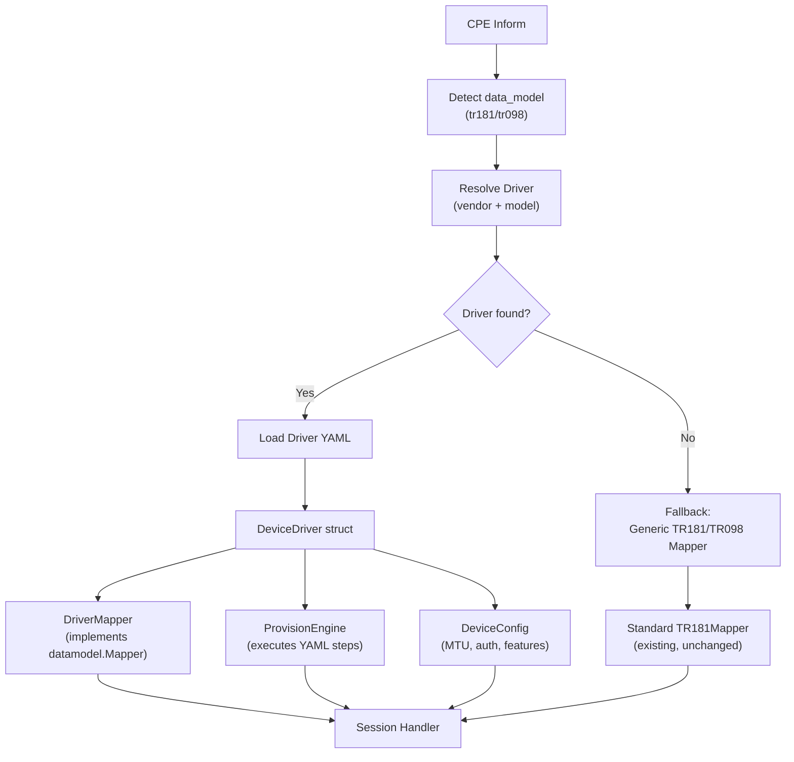

# Device Driver Architecture — Refactor Hardcoded Vendor Logic

## Goal

Mengganti semua vendor-specific hardcode (terutama TP-Link) dengan arsitektur **"device driver"** berbasis YAML. Penambahan merek/model baru seharusnya cukup dengan **driver YAML** (termasuk WiFi SSID→band lewat `wifi_ssid_band_without_lower_layers` strategy `explicit`); perubahan Go hanya bila pola baru membutuhkan **strategy** yang belum ada di engine.

Setiap brand dan bahkan type ONT punya driver sendiri yang mendefinisikan:
- Provisioning flow (WAN PPPoE, WAN DHCP, dll)
- Device config (MTU, auth protocol, security mode mappings)
- Feature flags (GPON support, band steering, dll)
- Instance discovery hints (vendor-specific paths untuk WAN/WiFi/LAN detection)

---

## User Review Required

> [!IMPORTANT]
> **Konsep "Driver"**: Setiap ONT type punya driver directory sendiri. Resolusi driver: `model-specific → vendor-default → generic tr181/tr098`. Jika ada ONT TP-Link model XC220-G3v yang behaviournya beda dari TP-Link lain, dia bisa punya driver tersendiri.

> [!WARNING]
> **Breaking Change pada Schema Directory**: Struktur `schemas/` akan berubah. File YAML lama tetap kompatibel (parameter mapping), tapi ditambah file baru (`driver.yaml`, `provision_wan.yaml`). Saat startup, jika driver YAML tidak ditemukan untuk suatu device, ACS fallback ke behaviour lama (hardcoded mapper) sehingga tidak ada downtime.

> [!IMPORTANT]
> **Scope**: Refactoring ini fokus pada 4 area hardcode terbesar:
> 1. WAN PPPoE provisioning flow (`wan_provision.go`)
> 2. WiFi band steering + security mode mapping (`session.go`, `executor.go`)
> 3. Instance discovery vendor hints (`instances.go`)
> 4. WAN info extraction vendor-specific paths (`results.go`)
>
> Fitur yang sudah generic (Reboot, Firmware, Diagnostics, Port Forwarding) **tidak diubah**.

---

## Proposed Changes

### Overview Architecture



### New Directory Structure

```
schemas/
├── tr181/                                    # Generic TR-181 (unchanged)
│   ├── wifi.yaml
│   ├── wan.yaml
│   ├── lan.yaml
│   └── ...
├── tr098/                                    # Generic TR-098 (unchanged)
│   └── ...
└── vendors/
    ├── tplink/
    │   └── tr181/
    │       ├── driver.yaml                   # [NEW] Device driver config
    │       ├── provision_wan_pppoe.yaml       # [NEW] PPPoE provisioning steps
    │       ├── provision_wan_pppoe_update.yaml# [NEW] PPPoE credential/VLAN update
    │       ├── wifi.yaml                     # (existing) WiFi path overrides
    │       ├── wan.yaml                      # (existing) WAN path overrides
    │       └── lan.yaml                      # (existing) LAN path overrides
    │
    ├── tplink/
    │   └── models/                           # [NEW] Per-model overrides
    │       └── XC220-G3v/
    │           └── tr181/
    │               └── driver.yaml           # Overrides tplink defaults
    │
    ├── huawei/
    │   └── tr181/
    │       ├── driver.yaml
    │       ├── provision_wan_pppoe.yaml
    │       └── change_password.yaml         # (existing)
    │
    └── zte/
        └── tr098/
            ├── driver.yaml
            └── change_password.yaml          # (existing)
```

### Driver Resolution Priority

```
1. vendors/<vendor>/models/<model>/tr181/    (most specific)
2. vendors/<vendor>/tr181/                   (vendor default)  
3. tr181/                                    (generic, has no driver.yaml)
```

---

### Component 1: Driver YAML Format Design

#### [NEW] `driver.yaml` — Device Driver Configuration

```yaml
# schemas/vendors/tplink/tr181/driver.yaml
id: tplink_tr181
vendor: tplink
model: tr181
description: "TP-Link GPON ONT TR-181 device driver"

# Feature flags — what this device type supports
features:
  gpon: true
  band_steering: true
  ipv6: true
  nat: true
  dhcpv6_client: true

# Device defaults
config:
  ppp_auth_protocol: "AUTO_AUTH"
  default_mtu: "1492"
  optical_interface: "Device.Optical.Interface.1."
  gpon_root: "Device.X_TP_GPON.Link"

# Security mode mapping (UI value → TR-069 value)  
security_modes:
  "WPA2-PSK": "WPA2-Personal"
  "WPA-WPA2-PSK": "WPA-WPA2-Personal"
  "WPA3-SAE": "WPA3-Personal"
  "None": "None"

# WiFi vendor-specific features
wifi:
  band_steering_path: "Device.WiFi.X_TP_BandSteering.Enable"
  multi_ssid_suffix_24g: "Device.WiFi.X_TP_MultiSSIDSuffix24G"
  multi_ssid_suffix_5g: "Device.WiFi.X_TP_MultiSSIDSuffix5G"
  sync_bands_on_steering: true

# Instance discovery hints — vendor-specific parameter paths
# used by DiscoverInstances to find WAN/LAN/WiFi indices
discovery:
  wan_type_path: "Device.IP.Interface.{i}.X_TP_ConnType"
  wan_type_values:
    wan: ["PPPoE", "DHCP", "Static"]
    lan: ["LAN"]
    bridge: ["Bridge"]
  gpon_enable_path: "Device.X_TP_GPON.Link.{i}.Enable"
  wan_uptime_path: "Device.IP.Interface.{i}.X_TP_Uptime"
  wan_service_type_path: "Device.IP.Interface.{i}.X_TP_ServiceType"
  host_conn_type_path: "Hosts.Host.{i}.X_TP_LanConnType"
  host_conn_type_values:
    wifi: "1"
    lan: "0"
  # Optional: WiFi SSID→band when SSID.LowerLayers is absent (no Go change for new models
  # if you use strategy "explicit" and list indices per band).
  # wifi_ssid_band_without_lower_layers:
  #   strategy: pair_block_mod2   # or explicit / legacy_tplink_multi
  #   explicit:
  #     "0": [1, 2, 5, 6]
  #     "1": [3, 4, 7, 8]

# Provisioning flows — reference to YAML step-sequence files
provisions:
  wan_pppoe_new: "provision_wan_pppoe.yaml"
  wan_pppoe_update: "provision_wan_pppoe_update.yaml"
```

#### [NEW] `provision_wan_pppoe.yaml` — Provisioning Step Sequence

```yaml
id: wan_pppoe_new
vendor: tplink
model: tr181
description: "Fresh PPPoE provisioning for TP-Link GPON ONT"

# Input variables (provided by the Go engine at runtime)
# Available: {vlan_id}, {username}, {password}, {gpon_idx}, {optical_iface}
# Step-created: {eth}, {vterm}, {ppp}, {ip}, {nat}, {dhcpv6}

steps:
  # Phase 1: Setup GPON Link
  - kind: set
    when: gpon_reuse        # condition evaluated by engine
    params:
      "{gpon_root}.{gpon_idx}.Alias": "Link_{vlan_id}"
      "{gpon_root}.{gpon_idx}.LowerLayers": "{optical_iface}"

  - kind: add_object
    when: gpon_create
    object: "{gpon_root}."
    as: gpon_idx
  
  - kind: set
    when: gpon_create
    params:
      "{gpon_root}.{gpon_idx}.Alias": "Link_{vlan_id}"
      "{gpon_root}.{gpon_idx}.LowerLayers": "{optical_iface}"

  # Phase 2: Ethernet Link
  - kind: add_object
    object: "Device.Ethernet.Link."
    as: eth

  - kind: set
    params:
      "Device.Ethernet.Link.{eth}.Alias": "ethlink_{vlan_id}"
      "Device.Ethernet.Link.{eth}.Enable": "1"
      "Device.Ethernet.Link.{eth}.LowerLayers": "{gpon_root}.{gpon_idx}."

  # Phase 3: VLAN Termination
  - kind: add_object
    object: "Device.Ethernet.VLANTermination."
    as: vterm

  - kind: set
    params:
      "Device.Ethernet.VLANTermination.{vterm}.Alias": "VLAN_{vlan_id}"
      "Device.Ethernet.VLANTermination.{vterm}.Enable": "1"
      "Device.Ethernet.VLANTermination.{vterm}.LowerLayers": "Device.Ethernet.Link.{eth}."
      "Device.Ethernet.VLANTermination.{vterm}.VLANID": "{vlan_id}"

  # Phase 4: PPP Interface
  - kind: add_object
    object: "Device.PPP.Interface."
    as: ppp

  # Phase 5: IP Interface
  - kind: add_object
    object: "Device.IP.Interface."
    as: ip

  - kind: set
    params:
      "Device.IP.Interface.{ip}.LowerLayers": "Device.PPP.Interface.{ppp}."

  - kind: set
    params:
      "Device.PPP.Interface.{ppp}.Alias": "Internet_PPPoE"
      "Device.PPP.Interface.{ppp}.AuthenticationProtocol": "{ppp_auth_protocol}"
      "Device.PPP.Interface.{ppp}.LowerLayers": "Device.Ethernet.VLANTermination.{vterm}."
      "Device.PPP.Interface.{ppp}.Password": "{password}"
      "Device.PPP.Interface.{ppp}.Username": "{username}"

  - kind: set
    params:
      "Device.IP.Interface.{ip}.Alias": "Internet_PPPoE"
      "Device.IP.Interface.{ip}.IPv4Enable": "1"
      "Device.IP.Interface.{ip}.MaxMTUSize": "{default_mtu}"

  # Phase 6: NAT (conditional)
  - kind: add_object
    when: feature_nat
    object: "Device.NAT.InterfaceSetting."
    as: nat

  - kind: set
    when: feature_nat
    params:
      "Device.NAT.InterfaceSetting.{nat}.Interface": "Device.IP.Interface.{ip}."

  # Phase 7: Enable all
  - kind: set
    params:
      "Device.IP.Interface.{ip}.Enable": "1"
      "Device.PPP.Interface.{ppp}.Enable": "1"
      "Device.Ethernet.VLANTermination.{vterm}.Enable": "1"
      "Device.Ethernet.Link.{eth}.Enable": "1"

  - kind: set
    when: feature_nat
    params:
      "Device.NAT.InterfaceSetting.{nat}.Enable": "1"

  - kind: set
    when: feature_gpon
    params:
      "{gpon_root}.{gpon_idx}.Enable": "1"
```

---

### Component 2: Driver Engine (Go Code)

#### [NEW] [driver.go](file:///home/well/helix-acs/internal/schema/driver.go)

Core struct dan loader:

```go
// DeviceDriver holds the complete driver configuration for a vendor/model.
type DeviceDriver struct {
    ID          string           
    Vendor      string           
    Model       string           
    Features    map[string]bool         // "gpon" → true, "band_steering" → true
    Config      map[string]string       // "ppp_auth_protocol" → "AUTO_AUTH"
    SecurityModes map[string]string     // "WPA2-PSK" → "WPA2-Personal"
    WiFi        WiFiDriverConfig
    Discovery   DiscoveryConfig
    Provisions  map[string]*ProvisionFlow  // "wan_pppoe_new" → loaded steps
}

// DeviceDriverRegistry loads and resolves drivers by vendor/model.
type DeviceDriverRegistry struct {
    drivers map[string]*DeviceDriver  // keyed by resolved name
}

func (r *DeviceDriverRegistry) Resolve(vendor, model, dataModel string) *DeviceDriver
func (r *DeviceDriverRegistry) LoadDir(root string) error
```

#### [NEW] [provision.go](file:///home/well/helix-acs/internal/schema/provision.go)

Generic provision flow executor (replaces hardcoded `wan_provision.go`):

```go
// ProvisionFlow is a parsed sequence of provisioning steps from YAML.
type ProvisionFlow struct {
    ID    string
    Steps []ProvisionStep
}

// ProvisionStep is one step: AddObject, SetParameterValues, or DeleteObject.
type ProvisionStep struct {
    Kind    string            // "add_object", "set", "delete"
    When    string            // condition: "gpon_reuse", "feature_nat", etc.
    Object  string            // for add_object/delete
    As      string            // variable name to store instance number
    Params  map[string]string // for set: key→value templates
}

// ProvisionExecutor runs a ProvisionFlow step-by-step during CWMP session.
type ProvisionExecutor struct {
    flow     *ProvisionFlow
    driver   *DeviceDriver
    vars     map[string]string   // runtime variables
    features map[string]bool     // evaluated feature flags
    cur      int
}

func NewProvisionExecutor(flow *ProvisionFlow, driver *DeviceDriver, inputVars map[string]string) *ProvisionExecutor
func (pe *ProvisionExecutor) BuildCurrentXML() ([]byte, error)
func (pe *ProvisionExecutor) OnAddObject(instanceNum int) ([]byte, error)
func (pe *ProvisionExecutor) OnSetParams() ([]byte, error)
func (pe *ProvisionExecutor) Done() bool
```

---

### Component 3: Session Handler Refactoring

#### [MODIFY] [session.go](file:///home/well/helix-acs/internal/cwmp/session.go)

Perubahan utama:

1. **`Session` struct** — tambah `driver *schema.DeviceDriver`
2. **`Handler` struct** — tambah `driverRegistry *schema.DeviceDriverRegistry`
3. **`handleInform()`** — resolve driver setelah detect data model
4. **`executeTask()` case `TypeWAN`** — gunakan `ProvisionExecutor` dari driver, bukan hardcoded `newWANProvision()`
5. **`executeTask()` case `TypeWifi`** — gunakan `driver.SecurityModes` dan `driver.WiFi` config
6. **`handleSetParamValuesResponse()`** — tetap sama, `ProvisionExecutor` kompatibel dengan interface `WANProvision` lama
7. **`finishSummon()`** — gunakan `driver.Discovery` untuk vendor-specific extraction

#### [MODIFY] [wan_provision.go](file:///home/well/helix-acs/internal/cwmp/wan_provision.go)

`WANProvision` struct diubah menjadi wrapper tipis di atas `schema.ProvisionExecutor`:

```go
type WANProvision struct {
    t   *task.Task
    exe *schema.ProvisionExecutor
}

func newWANProvisionFromDriver(t *task.Task, driver *schema.DeviceDriver, flowName string, vars map[string]string) (*WANProvision, error) {
    flow := driver.Provisions[flowName]
    if flow == nil {
        return nil, fmt.Errorf("driver %s has no provision flow %q", driver.ID, flowName)
    }
    return &WANProvision{
        t:   t,
        exe: schema.NewProvisionExecutor(flow, driver, vars),
    }, nil
}
```

#### [MODIFY] [executor.go](file:///home/well/helix-acs/internal/task/executor.go)

- Hapus hardcoded `Device.WiFi.X_TP_BandSteering.Enable`
- Hapus hardcoded security mode mapping
- Terima `*schema.DeviceDriver` sebagai parameter opsional untuk config lookup

#### [MODIFY] [results.go](file:///home/well/helix-acs/internal/cwmp/results.go)

- `extractBandSteeringStatus()` → baca path dari `driver.WiFi.BandSteeringPath`
- `extractWANInfos()` → baca vendor paths dari `driver.Discovery`
- `parseConnectedHosts()` → baca host type paths dari `driver.Discovery`

#### [MODIFY] [instances.go](file:///home/well/helix-acs/internal/datamodel/instances.go)

- `discoverTR181WAN()` Pass 0 → baca `wan_type_path` dari driver config, bukan hardcoded `X_TP_ConnType`
- `discoverTR181FreeGPON()` → baca `gpon_enable_path` dari driver, skip jika not configured

---

### Component 4: Resolver Enhancement

#### [MODIFY] [resolver.go](file:///home/well/helix-acs/internal/schema/resolver.go)

Tambah model-level resolution:

```go
// ResolveDriver returns the driver name for a device.
// Priority: vendor/model/tr181 → vendor/tr181 → "" (no driver)
func (r *Resolver) ResolveDriver(manufacturer, productClass, dataModel string) string {
    vendor := normaliseVendor(manufacturer)
    model := normaliseModel(productClass)
    
    if vendor != "" && model != "" {
        candidate := "vendor/" + vendor + "/" + model + "/" + dataModel
        if r.driverRegistry.Has(candidate) {
            return candidate
        }
    }
    if vendor != "" {
        candidate := "vendor/" + vendor + "/" + dataModel
        if r.driverRegistry.Has(candidate) {
            return candidate
        }
    }
    return "" // no driver, use legacy mappers
}
```

---

### Component 5: Migrate Existing TP-Link Logic

#### [NEW] Schema YAML Files

| File | Contents |
|------|----------|
| `schemas/vendors/tplink/tr181/driver.yaml` | TP-Link device driver config (migrated from hardcode) |
| `schemas/vendors/tplink/tr181/provision_wan_pppoe.yaml` | Fresh PPPoE flow (migrated from `newWANProvision()`) |
| `schemas/vendors/tplink/tr181/provision_wan_pppoe_update.yaml` | Credential/VLAN update flow (migrated from `executeTask TypeWAN`) |

#### [DELETE] Hardcoded Functions

| Function | File | Replacement |
|----------|------|-------------|
| `newWANProvision()` | `wan_provision.go` | `ProvisionExecutor` + YAML |
| `newWANProvisionDeleteAndAdd()` | `wan_provision.go` | `ProvisionExecutor` + YAML |
| Hardcoded `X_TP_BandSteering` | `executor.go:40` | `driver.WiFi.BandSteeringPath` |
| Hardcoded security mapping | `executor.go:61-65` | `driver.SecurityModes` |
| Hardcoded `X_TP_ConnType` scan | `results.go:287` | `driver.Discovery.WANTypePath` |
| Hardcoded GPON regex | `instances.go:107` | `driver.Discovery.GPONEnablePath` |

---

## Open Questions

> [!IMPORTANT]
> **1. Per-Model Scope**: Apakah per-model override (`vendors/tplink/models/XC220-G3v/tr181/`) diperlukan sekarang, atau cukup per-vendor dulu? Per-model menambah kompleksitas resolver tapi memberikan fleksibilitas maksimal.

> [!IMPORTANT]  
> **2. Deprovision Flow**: Apakah `provision_wan_pppoe_delete.yaml` (untuk hapus WAN connection sebelum buat baru) juga perlu dibuatkan sebagai YAML terpisah? Saat ini `newWANProvisionDeleteAndAdd()` menggabungkan delete + add. Saya usulkan pisah menjadi 2 file: `deprovision_wan.yaml` + `provision_wan_pppoe.yaml`.

> [!IMPORTANT]
> **3. Backward Compatibility**: Jika device connect tapi tidak ada driver YAML untuk vendornya, apakah:
> - (A) Fallback ke hardcoded mapper lama (safe, no breaking change)
> - (B) Refuse provisioning tasks, hanya izinkan read operations
> - (C) Gunakan generic TR-181 provisioning flow (mungkin gagal untuk vendor tertentu)
>
> Saya rekomendasikan **(A)** untuk transisi smooth.

---

## Verification Plan

### Automated Tests

1. **Unit test `ProvisionExecutor`**: Load TP-Link YAML, verify step sequence matches current hardcoded output
2. **Unit test `DeviceDriverRegistry`**: Load `schemas/` directory, verify resolution priority
3. **Unit test security mode mapping**: Verify `driver.SecurityModes` produces same output as hardcoded
4. **Existing tests**: Semua test di `session_test.go`, `datamodel_test.go`, `instances_test.go` harus tetap pass

```bash
go test ./internal/schema/... -v
go test ./internal/cwmp/... -v
go test ./internal/datamodel/... -v
```

### Manual Verification

1. Start ACS → verify TP-Link GPON ONT connects dan data model terdeteksi
2. Queue WAN PPPoE task → verify provisioning flow berjalan via YAML steps
3. Queue WiFi task → verify security mode mapping via driver config
4. Verify device tanpa driver YAML → fallback ke mapper lama tanpa error
