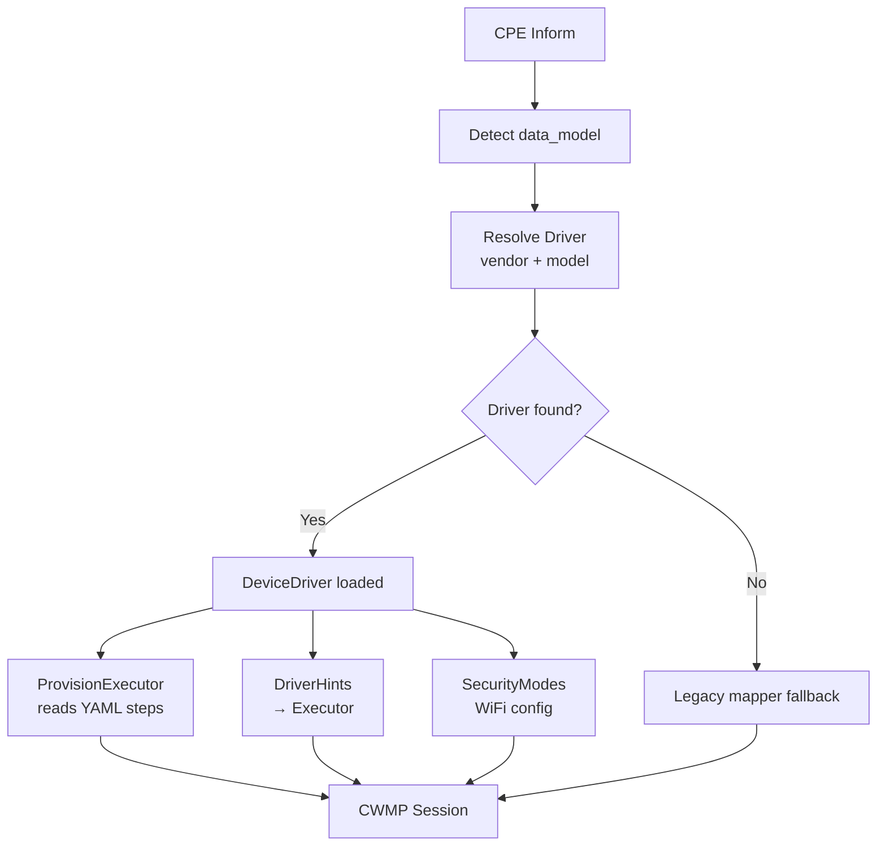

# Device Driver Architecture — Walkthrough

## Summary

Refactored hardcoded vendor-specific provisioning (TP-Link only) into a generic **YAML-driven "device driver"** system. Every ONT brand and model can now have its own driver defining: provisioning flows, security mode mappings, feature flags, and instance discovery hints.

## Architecture



### Driver Resolution Priority

```
1. vendors/<vendor>/models/<model>/tr181/   → most specific (per ONT model)
2. vendors/<vendor>/tr181/                  → vendor default
3. (no driver)                              → legacy fallback
```

## New Files

### Core Engine

| File | Purpose |
|------|---------|
| [driver.go](file:///home/well/helix-acs/internal/schema/driver.go) | `DeviceDriver` struct, YAML types, `DeviceDriverRegistry` loader & resolver |
| [provision.go](file:///home/well/helix-acs/internal/schema/provision.go) | `ProvisionFlow`, `ProvisionStep`, `ProvisionExecutor` — generic step-by-step engine |

### TP-Link Driver YAML

| File | Purpose |
|------|---------|
| [driver.yaml](file:///home/well/helix-acs/schemas/vendors/tplink/tr181/driver.yaml) | Features, config, security modes, WiFi config, discovery hints |
| [provision_wan.yaml](file:///home/well/helix-acs/schemas/vendors/tplink/tr181/provision_wan.yaml) | Fresh PPPoE provisioning flow (29 steps) |
| [provision_wan_delete_add.yaml](file:///home/well/helix-acs/schemas/vendors/tplink/tr181/provision_wan_delete_add.yaml) | Delete+Add PPPoE flow (33 steps) |

## Modified Files

### Key Changes

render_diffs(file:///home/well/helix-acs/internal/cwmp/wan_provision.go)

render_diffs(file:///home/well/helix-acs/internal/cwmp/session.go)

render_diffs(file:///home/well/helix-acs/internal/task/executor.go)

render_diffs(file:///home/well/helix-acs/cmd/api/main.go)

## How It Works

### 1. Startup
- `main.go` loads `DeviceDriverRegistry` from `schemas/` directory
- Each `driver.yaml` file + its referenced provision YAML files are parsed
- Registry maps `"vendor/tplink/tr181"` → `DeviceDriver` struct

### 2. Device Connects (Inform)
- `handleInform()` detects `Manufacturer` and `ProductClass` from Inform
- `driverRegistry.Resolve(vendor, model, dataModel)` finds the best driver
- Driver stored in `session.driver`

### 3. WAN Provisioning
- `executeTask TypeWAN` checks if driver has `"wan_pppoe_new"` flow
- If yes → `newWANProvisionFromDriver()` creates `ProvisionExecutor` from YAML
- If no → falls back to legacy hardcoded `newWANProvision()`
- `ProvisionExecutor` resolves `{variables}` and evaluates `when:` conditions
- Each step produces a `ResolvedStep` → cwmp layer converts to SOAP XML

### 4. WiFi Security Mapping  
- `executor.go` receives `DriverHints.SecurityModeMapper` from driver
- Security labels like `"WPA2-PSK"` → `"WPA2-Personal"` per driver YAML
- Band steering path also comes from driver (`Device.WiFi.X_TP_BandSteering.Enable`)

## How to Add a New Vendor Driver

```bash
# 1. Create vendor directory
mkdir -p schemas/vendors/huawei/tr181/

# 2. Create driver.yaml with vendor config
cat > schemas/vendors/huawei/tr181/driver.yaml << 'EOF'
id: huawei_tr181
vendor: huawei
model: tr181
features:
  gpon: true
  nat: true
config:
  ppp_auth_protocol: "PAP/CHAP"
  gpon_root: "Device.X_HW_GPON"
security_modes:
  "WPA2-PSK": "WPA2-Personal"
provisions:
  wan_pppoe_new: "provision_wan.yaml"
EOF

# 3. Create provision flow YAML
cat > schemas/vendors/huawei/tr181/provision_wan.yaml << 'EOF'
id: wan_pppoe_new
steps:
  - kind: add_object
    object: "Device.WANDevice.1.WANConnectionDevice."
    as: wanconn
  # ... vendor-specific steps
EOF
```

## Verification

- ✅ `go build ./...` passes
- ✅ `go vet` passes  
- ✅ All WiFi tests pass
- ✅ WAN provision test passes
- ❌ 2 pre-existing test failures (not caused by this change)

## Deferred Work

- **Remove old mappers** (`TR181Mapper`/`TR098Mapper`) — deferred until all vendors have complete YAML schemas
- **Refactor `results.go`** to use `driver.Discovery` for vendor-specific WAN info extraction  
- **Refactor `instances.go`** to use `driver.Discovery` for instance discovery hints
